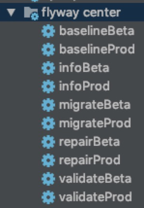

# Flyway Center
Flyway Center is mainly used to add multi-environment support to Flyway


# Usage
### Apply Plugin
```groovy
buildscript {
   
    dependencies {
        classpath group: 'mysql', name: 'mysql-connector-java', version: '8.0.13'
        classpath 'me.jinuo.backend:flyway-center:1.0.0-SNAPSHOT'
    }
    
}

apply plugin: 'flyway-center'

```

### Config Database
```groovy

flyway_center{
    driver = 'com.mysql.cj.jdbc.Driver'
    env {
        beta {
            url = 'jdbc:mysql://xxxxxxxx:3306/flyway_test'
            user = 'xxxxx'
            password = 'xxxxx'
            target = '3.1.5'
        }
        prod {
            // any operation in protected env must be confirm
            protect = true
            url = 'jdbc:mysql://xxxxxxxx:3306/flyway_prod'
            user = 'xxxxx'
            password = 'xxxxx'
            target = '3.1.5'
        }
    }
}

```


### Start
There will be several task created by flyway center in group `flyway center` 



**Example**
```java

➜  ./gradlew infoBeta   

> Task :infoBeta
Schema version: 3
+-----------+---------+----------------+------+---------------------+---------+
| Category  | Version | Description    | Type | Installed On        | State   |
+-----------+---------+----------------+------+---------------------+---------+
| Versioned | 1       | INIT           | SQL  | 2019-01-16 06:23:29 | Success |
| Versioned | 2       | ADD PEOPLE     | SQL  | 2019-01-16 06:26:44 | Success |
| Versioned | 3       | ADD PEOPEL TOO | JDBC | 2019-01-17 04:46:38 | Success |
| Versioned | 3.1.5   | ADD TABLE2     | SQL  |                     | Pending |
+-----------+---------+----------------+------+---------------------+---------+


BUILD SUCCESSFUL in 3s
4 actionable tasks: 1 executed, 3 up-to-date

```

```java

➜  ./gradlew migrateProd

Please enter 'migrate prod' to comfirm dangerous action:  (default: no): migrate prod


BUILD SUCCESSFUL in 16s
4 actionable tasks: 1 executed, 3 up-to-date

```

